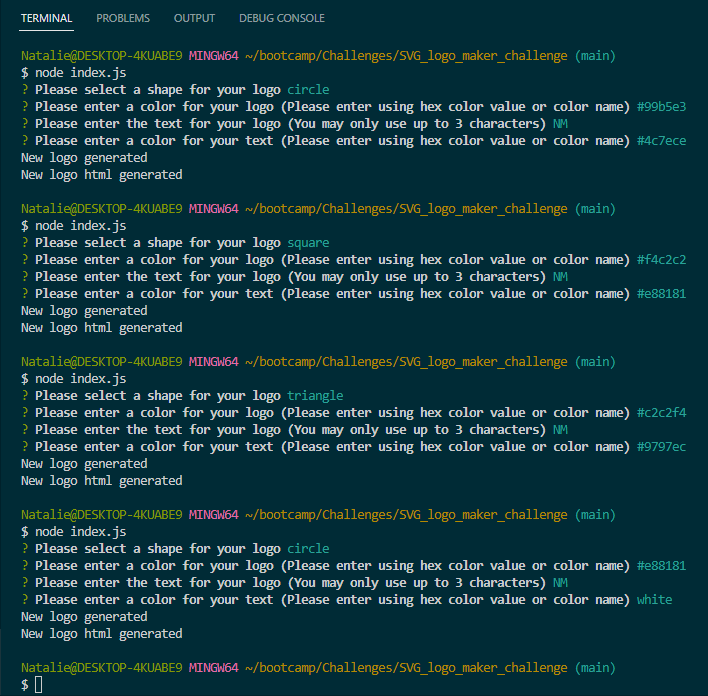
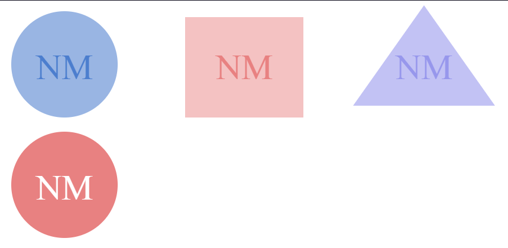
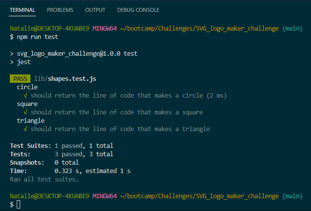

# SVG Logo Maker Challenge

## Description

This application was desgined to generate a logo using SVGs (Scalable Vector Graphics) and user input. Through this application users can make a simple logo for professional use. The application allows for users to enter text in their logo, and to select a shape for thier SVG using the three most common shapes of circle, square, and triangle. In addition, users are able to select the color of the text and shape of their logo thgrough the use of color names or hex color values thus allowing for more methods of personalization.

## Installation

Node.js and NPMs: Inquirer and Jest

## Usage

HTML, JavaScript, Markdown

## Demos

Links below show functionality of the application.

``` **Important:** Within the videos linked below, when demonstarting the ability to determine a color for the shape and text of the svg both hex color value and color name are used. Thus showing the ability for users to do the same.```

[Screencastify Demo](https://watch.screencastify.com/v/JlSLepYcuqVPrES5KkYg)

[MP4 Download Demo](examples/videos/SVG%20Logo%20Maker.mp4)







## Credits

Rutger University: https://git.bootcampcontent.com/Rutgers-University/RUT-VIRT-FSF-FT-02-2023-U-LOLC

### References:
- [Color hex ](https://www.color-hex.com) (used for selecting colors of logos and getting hex value)
- [SVG](https://en.wikipedia.org/wiki/SVG)
- [SVG tutorial](https://developer.mozilla.org/en-US/docs/Web/SVG/Tutorial)
- [Basic SVG shapes](https://developer.mozilla.org/en-US/docs/Web/SVG/Tutorial/Basic_Shapes)
- [Text in SVG](https://developer.mozilla.org/en-US/docs/Web/SVG/Tutorial/Texts)
- [Instuctor Videos: JD Tadlock](https://gist.github.com/jdtdesigns/9cfe05400063902e46aa5f6faabff0ca)

Tutoring on 5/11/23 with John Compagnoni:
- Helped with debugging code.

## License

MIT License

Copyright (c) [2023] [Matos,Natalie]

Permission is hereby granted, free of charge, to any person obtaining a copy
of this software and associated documentation files (the "Software"), to deal
in the Software without restriction, including without limitation the rights
to use, copy, modify, merge, publish, distribute, sublicense, and/or sell
copies of the Software, and to permit persons to whom the Software is
furnished to do so, subject to the following conditions:

The above copyright notice and this permission notice shall be included in all
copies or substantial portions of the Software.

THE SOFTWARE IS PROVIDED "AS IS", WITHOUT WARRANTY OF ANY KIND, EXPRESS OR
IMPLIED, INCLUDING BUT NOT LIMITED TO THE WARRANTIES OF MERCHANTABILITY,
FITNESS FOR A PARTICULAR PURPOSE AND NONINFRINGEMENT. IN NO EVENT SHALL THE
AUTHORS OR COPYRIGHT HOLDERS BE LIABLE FOR ANY CLAIM, DAMAGES OR OTHER
LIABILITY, WHETHER IN AN ACTION OF CONTRACT, TORT OR OTHERWISE, ARISING FROM,
OUT OF OR IN CONNECTION WITH THE SOFTWARE OR THE USE OR OTHER DEALINGS IN THE
SOFTWARE.
